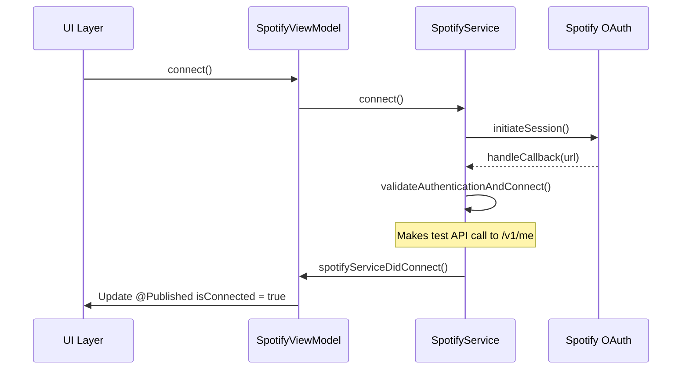

# Spotify Integration Architecture Analysis

## Overview

This document provides a comprehensive analysis of the current Spotify integration architecture in the RunBeat iOS app, identifying pain points and proposing improvements.

## Current Architecture Overview

The Spotify integration follows a **layered MVVM architecture** with the following components:

```
UI Layer
├── PlaylistSelectionView.swift
├── VO2MaxTrainingView.swift
└── ContentView.swift

ViewModel Layer
├── SpotifyViewModel.swift (Singleton - Main UI State)
└── SpotifyManager.swift (Compatibility Wrapper)

Service Layer
├── SpotifyService.swift (Core Business Logic)
├── SpotifyPlaylist.swift (Data Models)
└── ConfigurationManager.swift (Config)

External Dependencies
├── SpotifyiOS SDK (AppRemote)
└── Spotify Web API (REST)
```

## File Structure and Responsibilities

### Core Components

#### 1. SpotifyService.swift (1,528 lines)
**Role**: Core business logic and API integration
**Key Responsibilities**:
- OAuth authentication flow management
- AppRemote connection management
- Web API calls for playback control and data fetching
- Device activation and playlist playback
- Track polling for real-time updates
- Error handling and token management

**Notable Features**:
- Complex retry mechanisms for track fetching
- Background/foreground state management
- Fallback strategies (AppRemote → Web API → URL schemes)

#### 2. SpotifyViewModel.swift (577 lines)
**Role**: UI state management and coordination
**Key Responsibilities**:
- @Published properties for SwiftUI binding
- Playlist selection persistence
- Connection status management
- UI state synchronization
- Service delegation

**State Properties**:
- `isConnected`: OAuth authentication status
- `currentTrack/Artist/Artwork`: Currently playing track info
- `isPlaying`: Playback state
- `availablePlaylists`: User's playlists
- `playlistSelection`: Selected training playlists

#### 3. SpotifyManager.swift (110 lines)
**Role**: Compatibility wrapper for legacy code
**Purpose**: Maintains backward compatibility while transitioning to MVVM
**Status**: Deprecated, delegates all calls to SpotifyViewModel

#### 4. SpotifyPlaylist.swift (112 lines)
**Role**: Data models and JSON parsing
**Contains**:
- `SpotifyPlaylist` struct with display properties
- API response models for Web API parsing
- `PlaylistSelection` for persisted user choices

## Authentication Flow Analysis

### Current Implementation



### Token Management

**Storage**: Tokens stored in memory only (not persisted)
- `accessToken: String?` in SpotifyService
- `isAuthenticated: Bool` flag

**Validation**: Active validation on every auth success
- Test API call to `/v1/me` endpoint
- Only marks connected after successful validation

**Refresh**: Handled automatically by SpotifyiOS SDK
- `sessionManager:didRenew:` delegate method updates tokens
- No manual refresh implementation

### Pain Points in Authentication

1. **No Token Persistence**: Users must re-authenticate every app restart
2. **Overvalidation**: Every auth success triggers a validation API call
3. **Connection State Confusion**: `isAuthenticated` vs `isConnected` vs `isAppRemoteConnected`

## Connection Management Analysis

### Dual API Strategy

The integration uses **two separate Spotify APIs** with different capabilities:

#### AppRemote (SpotifyiOS SDK)
- **Capabilities**: Real-time playback control, player state updates
- **Limitations**: Requires Spotify app installed, foreground-only in some scenarios
- **Use Cases**: Play/pause, skip, real-time track updates

#### Web API (REST)
- **Capabilities**: Full catalog access, cross-platform, background operation
- **Limitations**: Rate limited, eventual consistency, less real-time
- **Use Cases**: Playlist fetching, device management, background playback

### Connection State Management

**Multiple Connection States**:
```swift
// In SpotifyService
private(set) var isAuthenticated = false        // OAuth token valid
private(set) var isAppRemoteConnected = false   // AppRemote connected
private(set) var accessToken: String?           // Token available

// In SpotifyViewModel  
@Published var isConnected = false              // UI connection state
@Published var connectionStatus: ConnectionStatus // Detailed status
```

### Reconnection Logic

**AppRemote Reconnection**:
```swift
private func handleAppWillEnterForeground() {
    if accessToken != nil && !isAppRemoteConnected {
        attemptAppRemoteReconnection()
    }
}
```

**Pain Point**: AppRemote disconnection triggers full re-authentication instead of simple reconnection.

## Data Sources and Flow Analysis

### Data Source Hierarchy

1. **AppRemote** (Preferred for real-time data)
   - Player state updates
   - Track information with image identifiers
   - Playback position

2. **Web API** (Fallback and comprehensive data)
   - Currently playing endpoint (`/v1/me/player/currently-playing`)
   - Detailed track metadata with artwork URLs
   - Playlist information

3. **Predicted Data** (During startup)
   - Immediate UI feedback
   - Replaced by real data when available

### Data Inconsistency Issues

The service implements **complex data validation** to detect inconsistencies:

```swift
// Compare AppRemote vs Web API data
if let lastWebAPITrack = lastFetchedTrackName {
    if lastWebAPITrack != trackName {
        print("⚠️ [DATA COMPARISON] MISMATCH DETECTED!")
        // Trigger comparison Web API fetch
        fetchCurrentTrackViaWebAPI(isValidationFetch: true)
    }
}
```

### Track Polling System

**Multi-stage fetch mechanism**:
1. **Fast Retry Phase**: 500ms intervals, up to 20 attempts
2. **Regular Polling**: 10-second intervals during training
3. **Validation Fetches**: On-demand consistency checks

```swift
func startTrackPolling() {
    // Two-stage fetch for workout start
    fetchFreshTrackDataForWorkout()
    
    // Set up timer for periodic updates
    trackPollingTimer = Timer.scheduledTimer(withTimeInterval: 10.0, repeats: true) { _ in
        self.fetchCurrentTrackViaWebAPI()
    }
}
```

## State Management Architecture

### UI State (SpotifyViewModel)

**Published Properties**:
- Connection state (`isConnected`, `connectionStatus`)
- Playback state (`isPlaying`, `currentTrack`, `currentArtist`, `currentAlbumArtwork`)
- Playlist state (`availablePlaylists`, `playlistSelection`, `playlistFetchStatus`)
- Loading state (`isFetchingTrackData`)

### Persistent State

**UserDefaults Storage**:
```swift
// Playlist selection
"SpotifyPlaylistSelection" -> PlaylistSelection struct
"CachedSelectedPlaylists" -> [SpotifyPlaylist] array
```

**Configuration (ConfigurationManager)**:
```swift
// From Config.plist or .env
spotifyClientID
spotifyClientSecret  
spotifyHighIntensityPlaylistID (legacy)
spotifyRestPlaylistID (legacy)
```

### Cross-Component Communication

**Delegate Pattern**: SpotifyService → SpotifyViewModel
```swift
protocol SpotifyServiceDelegate: AnyObject {
    func spotifyServiceDidConnect()
    func spotifyServiceDidDisconnect(error: Error?)
    func spotifyServicePlayerStateDidChange(isPlaying: Bool, trackName: String, artistName: String, artworkURL: String)
}
```

**Integration with Training System**:
```swift
// VO2MaxTrainingManager observes SpotifyViewModel
if VO2MaxTrainingManager.shared.isTraining && !VO2MaxTrainingManager.shared.isPaused {
    // Start appropriate playlist based on current phase
    switch VO2MaxTrainingManager.shared.currentPhase {
    case .highIntensity:
        self.playHighIntensityPlaylist()
    case .rest:
        self.playRestPlaylist()
    }
}
```

## Error Handling Analysis

### Error Types

**Custom Error Enum**:
```swift
enum SpotifyError: LocalizedError {
    case notAuthenticated
    case noData
    case apiError(Int)
    case networkError(String)
    case tokenExpired
    case insufficientPermissions
    case rateLimited
    case decodingError(String)
}
```

### Error Recovery Strategies

1. **Token Expiration**: Clear state and require re-authentication
2. **Network Errors**: Retry with exponential backoff
3. **Rate Limiting**: Delay and retry
4. **AppRemote Disconnection**: Attempt reconnection vs full re-auth

### Pain Points in Error Handling

1. **Aggressive Re-authentication**: Minor AppRemote disconnections trigger full OAuth flow
2. **Inconsistent Error Handling**: Different paths handle similar errors differently
3. **Limited Error Context**: Users don't get clear guidance on error resolution

## Key Pain Points Identified

### 1. AppRemote Disconnection Causes Full Re-Auth
**Problem**: AppRemote disconnection (common when app backgrounds) triggers full OAuth re-authentication instead of simple reconnection.

**Impact**: 
- Poor user experience
- Unnecessary OAuth flows
- Loss of session state

**Evidence**: Lines 1313-1317 in SpotifyService.swift
```swift
func appRemote(_ appRemote: SPTAppRemote, didDisconnectWithError error: Error?) {
    print("AppRemote: Disconnected with error: \(error?.localizedDescription ?? "No error")")
    isAppRemoteConnected = false
    delegate?.spotifyServiceDidDisconnect(error: error)  // Triggers full disconnect
}
```

### 2. Multiple Competing Data Sources
**Problem**: AppRemote and Web API provide different data formats and timing, creating validation complexity.

**Impact**:
- Complex validation logic (300+ lines)
- Data inconsistency detection
- Performance overhead

**Evidence**: Extensive data comparison logic in `playerStateDidChange` and `parseCurrentlyPlayingResponseWithDebug`

### 3. Inconsistent Connection State Management
**Problem**: Multiple boolean flags for connection state without clear single source of truth.

**States**:
- `isAuthenticated` (has valid token)
- `isAppRemoteConnected` (AppRemote connected)
- `isConnected` (UI connection state)
- `connectionStatus` (detailed status enum)

### 4. Authentication Happening Multiple Times
**Problem**: No token persistence leads to repeated authentication flows.

**Impact**:
- Poor user experience
- Unnecessary API calls
- Potential rate limiting

## Current File Coupling Issues

### High Coupling Areas

1. **SpotifyViewModel ↔ VO2MaxTrainingManager**: Direct cross-references for music coordination
2. **SpotifyService ↔ UIApplication**: Direct app state checking for background handling
3. **Multiple Data Models**: Playlist data scattered across SpotifyPlaylist, PlaylistSelection, and cached arrays

### Architectural Concerns

1. **Singleton Dependencies**: SpotifyViewModel.shared creates tight coupling
2. **Mixed Responsibilities**: SpotifyService handles both business logic and UI concerns
3. **Complex State Synchronization**: Manual @Published property binding in SpotifyManager

## Proposed Architectural Improvements

### 1. Authentication Layer Redesign

**Persistent Authentication**:
```swift
class SpotifyAuthenticationManager {
    private let keychain: KeychainService
    private let sessionManager: SPTSessionManager
    
    func persistToken(_ token: String) {
        keychain.store(token, key: "spotify_access_token")
    }
    
    func restoreSession() -> Bool {
        guard let token = keychain.retrieve(key: "spotify_access_token"),
              tokenIsValid(token) else { return false }
        
        // Set up session without full OAuth flow
        return true
    }
}
```

**Benefits**:
- Single authentication per install
- Faster app startup
- Better user experience

### 2. Connection State Management

**Single Source of Truth**:
```swift
class SpotifyConnectionManager {
    @Published var state: ConnectionState = .disconnected
    
    enum ConnectionState {
        case disconnected
        case authenticating
        case authenticated(token: String)
        case connecting
        case connected(AppRemoteConnectionInfo)
        case error(SpotifyError)
    }
    
    func handleAppRemoteDisconnection() {
        // Only attempt reconnection, don't invalidate auth
        if case .connected = state {
            state = .authenticated(currentToken)
            attemptReconnection()
        }
    }
}
```

### 3. Unified Data Source Strategy

**Data Source Coordinator**:
```swift
class SpotifyDataCoordinator {
    private let appRemote: AppRemoteService
    private let webAPI: WebAPIService
    
    func getCurrentTrack() -> AnyPublisher<TrackInfo, Never> {
        // Prefer AppRemote, fallback to Web API
        appRemote.currentTrack
            .catch { _ in webAPI.currentTrack }
            .eraseToAnyPublisher()
    }
}
```

### 4. Improved Error Handling

**Structured Error Recovery**:
```swift
class SpotifyErrorHandler {
    func handle(_ error: SpotifyError, context: ErrorContext) -> ErrorRecovery {
        switch error {
        case .appRemoteDisconnected:
            return .reconnectAppRemote
        case .tokenExpired:
            return .refreshToken
        case .networkError:
            return .retryAfterDelay
        }
    }
}
```

### 5. Dependency Injection Architecture

**Remove Singleton Dependencies**:
```swift
// Instead of SpotifyViewModel.shared
class VO2TrainingCoordinator {
    private let spotifyService: SpotifyServiceProtocol
    
    init(spotifyService: SpotifyServiceProtocol) {
        self.spotifyService = spotifyService
    }
}
```

## Implementation Roadmap

### Phase 1: Authentication Persistence
1. Implement token persistence with Keychain
2. Add token validation on app launch
3. Separate AppRemote connection from authentication

### Phase 2: Connection State Consolidation
1. Create unified connection state enum
2. Implement connection state machine
3. Update UI to use single connection state

### Phase 3: Data Source Simplification
1. Implement data source coordinator
2. Remove complex validation logic
3. Standardize data models

### Phase 4: Error Handling Enhancement
1. Implement structured error recovery
2. Add user-friendly error messages
3. Implement retry strategies

### Phase 5: Dependency Injection
1. Remove singleton patterns
2. Implement protocol-based dependencies
3. Add dependency injection container

## Testing Considerations

### Current Testability Issues
- Singleton dependencies make unit testing difficult
- Network dependencies not mocked
- Complex state makes test setup challenging

### Proposed Testing Strategy
- Protocol-based dependency injection
- Mock implementations for external services
- State machine testing for connection flows
- Integration tests for authentication flow

## Conclusion

The current Spotify integration is functional but suffers from architectural complexity that impacts maintainability and user experience. The key issues are:

1. **No persistent authentication** leading to repeated OAuth flows
2. **AppRemote disconnections triggering full re-auth** instead of simple reconnection
3. **Multiple competing data sources** requiring complex validation
4. **Inconsistent connection state management** across multiple boolean flags

The proposed improvements focus on:
- **Persistent authentication** with Keychain storage
- **Unified connection state management** with clear state machine
- **Single source of truth** for connection status
- **Structured error recovery** with specific handling strategies

These changes would significantly improve user experience while reducing code complexity and improving maintainability.