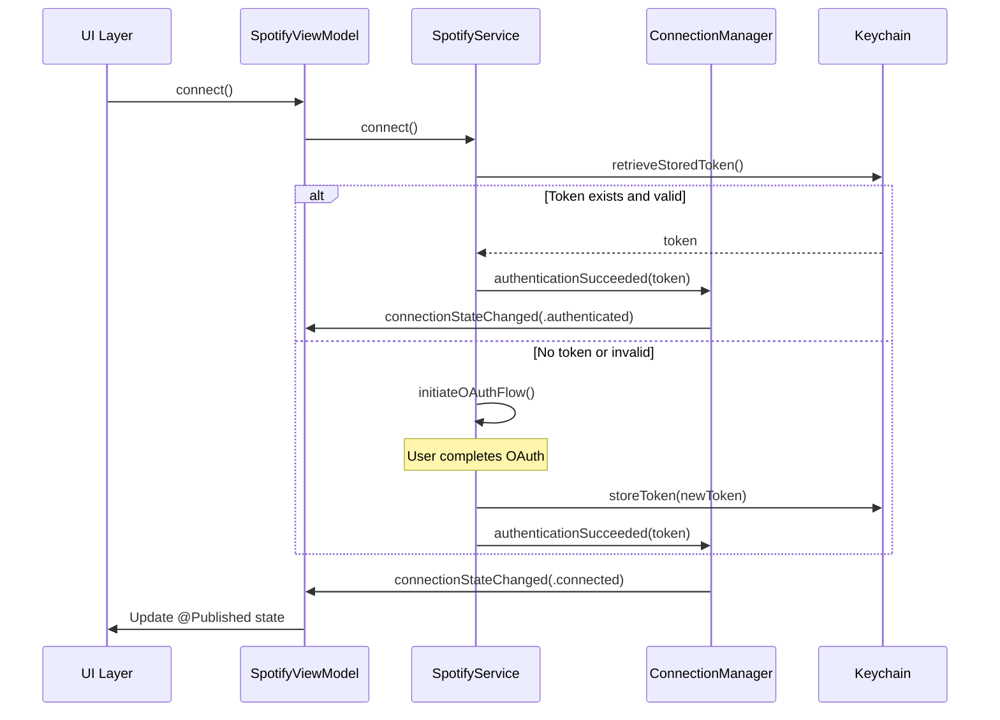

# Spotify Integration Architecture Documentation

## Overview

This document describes the current Spotify integration architecture in the RunBeat iOS app after the Phase 1-4 refactor completed in 2025. The integration now features persistent authentication, unified state management, coordinated data sources, and structured error handling.

## Current Architecture Overview

The Spotify integration follows a **layered MVVM architecture** with specialized components:

```
UI Layer
├── PlaylistSelectionView.swift
├── VO2MaxTrainingView.swift
└── ContentView.swift

ViewModel Layer
├── SpotifyViewModel.swift (Singleton - Main UI State)
└── SpotifyManager.swift (Legacy Compatibility)

Service Layer
├── SpotifyService.swift (Core Business Logic)
├── SpotifyConnectionManager.swift (State Machine)
├── SpotifyDataCoordinator.swift (Data Source Management)
├── SpotifyErrorHandler.swift (Error Recovery)
├── SpotifyPlaylist.swift (Data Models & Selection Persistence)
└── KeychainWrapper.swift (Secure Token Storage)

External Dependencies
├── SpotifyiOS SDK (AppRemote)
└── Spotify Web API (REST - Playlists & Playback)
```

## Core Components

### SpotifyService.swift
**Role**: Core business logic and orchestration
**Key Features**:
- OAuth authentication with keychain persistence
- AppRemote and Web API integration
- Device activation and playlist playback
- Automatic activation tracking to prevent duplicate playlist starts

### SpotifyConnectionManager.swift
**Role**: Unified connection state management
**Features**:
- Single source of truth for connection state
- State machine with proper transitions: `disconnected` → `authenticating` → `authenticated` → `connecting` → `connected`
- Error state handling with token preservation
- Eliminates multiple boolean connection flags

### SpotifyDataCoordinator.swift
**Role**: Intelligent data source coordination
**Features**:
- Priority-based data consolidation (AppRemote > Web API > Optimistic)
- Deduplication logic to prevent redundant UI updates
- Thread-safe data processing with dedicated queue
- Standardized `SpotifyTrackInfo` model across all sources

### SpotifyErrorHandler.swift
**Role**: Structured error recovery system
**Features**:
- Context-aware error recovery with `SpotifyRecoverableError` enum
- Exponential backoff retry strategies
- User-friendly error messages and recovery guidance
- Training-aware error handling (more aggressive during workouts)

### KeychainWrapper.swift
**Role**: Secure token persistence
**Features**:
- Encrypted token storage in iOS keychain
- Automatic token restoration on app launch
- Eliminates repeated OAuth flows

### SpotifyPlaylist.swift
**Role**: Playlist data models and selection management
**Features**:
- `SpotifyPlaylist` struct with display properties and metadata
- `PlaylistSelection` model for persistent user choices
- API response parsing for Web API playlist endpoints
- UserDefaults integration for selection persistence

### PlaylistSelectionView.swift
**Role**: User playlist selection interface
**Features**:
- Grid-based playlist display with artwork and metadata
- Separate selection flows for high-intensity and rest playlists
- Real-time selection persistence and validation
- Design system integration with AppColors and AppTypography

## Authentication Flow



## Data Flow Architecture

```mermaid
graph TD
    AR[AppRemote] --> DC[SpotifyDataCoordinator]
    WA[Web API] --> DC
    OP[Optimistic Updates] --> DC
    DC --> |Priority: AppRemote=3, WebAPI=2, Optimistic=1| UI[SpotifyViewModel]
    DC --> |Deduplication| UI
    UI --> |@Published| V[Views]
```

## Error Handling Strategy

The error handling system provides intelligent recovery:

```swift
enum SpotifyRecoverableError {
    case appRemoteDisconnected(underlying: Error?)
    case tokenExpired
    case rateLimited(retryAfter: TimeInterval?)
    case networkTimeout
    // ... other error types
}

enum ErrorRecoveryAction {
    case reconnectAppRemote
    case refreshToken
    case retryAfterDelay(TimeInterval)
    case retryWithExponentialBackoff
    case showUserAuthPrompt
    // ... other recovery actions
}
```

## Playlist Selection Architecture

**User-Selectable Playlist System**:
The app implements a comprehensive playlist selection system that replaces hardcoded playlist IDs with user choice:

### Data Models
```swift
struct SpotifyPlaylist: Identifiable, Codable, Hashable {
    let id: String
    let name: String
    let description: String?
    let trackCount: Int
    let imageURL: String?
    let isPublic: Bool
    let owner: String
}

struct PlaylistSelection: Codable {
    var highIntensityPlaylistID: String?
    var restPlaylistID: String?
    
    var isComplete: Bool {
        return highIntensityPlaylistID != nil && restPlaylistID != nil
    }
}
```

### Selection Flow
1. **Playlist Fetching**: Web API call to `/v1/me/playlists` retrieves user's playlists
2. **Grid Interface**: PlaylistSelectionView displays playlists with artwork and metadata
3. **Two-Stage Selection**: High-intensity playlist → Rest playlist with auto-advance
4. **Persistent Storage**: Selections saved to UserDefaults with JSON encoding
5. **Training Integration**: VO2MaxTrainingView validates selections before allowing training

### State Management
- `availablePlaylists: [SpotifyPlaylist]` - Fetched user playlists
- `playlistSelection: PlaylistSelection` - Current user selections  
- `playlistFetchStatus: PlaylistFetchStatus` - Loading/error states
- Backward compatibility with Config.plist playlist IDs

## Training Integration

**Seamless Training Flow**:
1. User selects playlists via in-app interface (persistent across sessions)
2. User starts training → Selected playlist begins automatically
3. App opens Spotify briefly for device activation
4. **Automatic activation tracking prevents duplicate playlist starts**
5. **Playlist switching** occurs seamlessly between high-intensity and rest intervals
6. User can manually browse Spotify without disrupting training music
7. Error recovery maintains music playback during network issues

**Playlist Switching Logic**:
```swift
switch VO2MaxTrainingManager.shared.currentPhase {
case .highIntensity:
    let playlistID = playlistSelection.highIntensityPlaylistID
    spotifyService.playHighIntensityPlaylist(playlistID: playlistID)
case .rest:
    let playlistID = playlistSelection.restPlaylistID
    spotifyService.playRestPlaylist(playlistID: playlistID)
}
```

## Key Improvements Implemented

### ✅ Phase 1: Authentication Persistence
- **Keychain token storage** - No repeated OAuth flows
- **Token validation on launch** - Automatic session restoration
- **Separated authentication from connection** - More robust state management

### ✅ Phase 2: Connection State Consolidation  
- **Unified SpotifyConnectionState enum** - Single source of truth
- **State machine validation** - Proper state transitions
- **Eliminated multiple boolean flags** - Cleaner connection logic

### ✅ Phase 3: Data Source Simplification
- **SpotifyDataCoordinator** - Intelligent data prioritization
- **Removed complex validation** - Replaced with deduplication
- **Standardized data models** - Consistent SpotifyTrackInfo struct

### ✅ Phase 4: Error Handling Enhancement
- **Structured error recovery** - Context-aware error handling
- **Exponential backoff retries** - Intelligent retry strategies  
- **User-friendly messages** - Clear error guidance

### ✅ Phase 5: Backend Integration & Playlist Restart Elimination
- **FastAPI Backend Service** - Centralized token management with Firebase storage
- **Intelligent Token Caching** - App lifecycle-aware caching reduces redundant API calls
- **Playlist Restart Fix** - Eliminated automatic music interruptions when switching between apps
- **Railway Deployment** - Production backend with monitoring and admin endpoints

## Performance Optimizations

- **Deduplication**: Prevents processing identical track/playing state updates
- **Connection management**: Single AppRemote connection with proper cleanup
- **Thread-safe processing**: Dedicated queues for data coordination
- **Smart polling**: Contextual track polling based on training state

## Current Status: Production Ready

**Resolved Issues**:
- ✅ Persistent authentication (no repeated OAuth)
- ✅ Single connection state source of truth  
- ✅ Intelligent data source coordination
- ✅ Structured error recovery with retry strategies
- ✅ Training music flow without restarts
- ✅ Clean duplicate connection prevention
- ✅ Background execution reliability (playlist switching during phone-away training)
- ✅ **Playlist restart interruptions** - App switching no longer disrupts music playback
- ✅ **Backend token management** - Centralized token storage and refresh with intelligent iOS caching
- ✅ **Intent-based lifecycle management** - Eliminates wasteful background reconnection cycles and improves separation of concerns

**Architecture Benefits**:
- **User Experience**: Seamless authentication and music control with no app-switching interruptions
- **Maintainability**: Clear separation of concerns and single responsibilities with intent-based resource management
- **Reliability**: Robust error handling and state management across all execution contexts
- **Performance**: Optimized data processing, connection management, intelligent token caching, and efficient battery usage
- **Background Training**: Reliable playlist switching during phone-away workouts
- **Scalability**: Backend service supports multi-device token management and monitoring
- **Resource Efficiency**: Intent-based lifecycle eliminates unnecessary background connections

## Implementation Roadmap Status

- ✅ **Phase 1: Authentication Persistence** - Complete
- ✅ **Phase 2: Connection State Consolidation** - Complete  
- ✅ **Phase 3: Data Source Simplification** - Complete
- ✅ **Phase 4: Error Handling Enhancement** - Complete (includes background execution regression fix)
- ✅ **Phase 5: Backend Integration & Playlist Restart Elimination** - Complete
- ✅ **Phase 6: Intent-Based Architecture** - Complete
- ⏸️ **Phase 7: Dependency Injection** - Deferred

**Phase 5 Completion Notes**: Successfully implemented FastAPI backend service with Railway deployment for centralized token management. Added intelligent iOS token caching based on app lifecycle. Most importantly, eliminated automatic playlist restart interruptions when users switch between apps - music now continues uninterrupted when returning from Spotify.

**Key Phase 5 Achievements**:
- Backend handles token refresh automatically during app suspension
- iOS requests fresh tokens only when needed (startup/foreground return)
- Fixed `SpotifyViewModel.handleFullyConnected()` and `VO2MaxTrainingManager.handleSpotifyConnectionChange()` to prevent unnecessary playlist restarts
- Maintained legitimate playlist changes during training phase transitions
- Added comprehensive backend monitoring and admin endpoints

### ✅ Phase 6: Intent-Based Architecture (2025)
**Problem Solved**: Separation of concerns issues and wasteful background reconnection cycles.

**Solutions Implemented**:
1. **SpotifyIntent Enum** - Controls AppRemote lifecycle based on app context
   - `.training` - Active training session requiring music control
   - `.idle` - App active but no training (minimal Spotify connection) 
   - `.background` - App backgrounded (suspended connections)

2. **AppState Bridging** - Eliminates dual ownership patterns
   - Views no longer have both `@StateObject trainingManager` and `@EnvironmentObject appState`
   - Single source of truth through AppState for training coordination
   - Cleaner view hierarchy without competing state managers

3. **Intent-Aware Error Recovery** - Context-sensitive error handling
   - Error recovery respects current intent (no recovery during `.idle`)
   - Training sessions get aggressive reconnection, idle state stays minimal
   - Background intent prevents unnecessary connection attempts

**Technical Implementation**: Intent-based architecture provides intelligent resource management where Spotify connections are only maintained when needed for training, eliminating wasteful background cycles and improving battery life.

**Phase 7 Status**: Dependency injection (removing singleton patterns, protocol-based dependencies) has been deferred as the current architecture provides excellent functionality and maintainability. The singleton pattern works well for this app's scale and use case.

## Testing Strategy

Current architecture supports:
- **Unit testing**: Clear component separation and focused responsibilities
- **Integration testing**: Well-defined interfaces between components  
- **State testing**: Predictable state machine behavior
- **Error testing**: Structured error scenarios and recovery paths

### Playlist Selection Testing
- **API Integration**: Test playlist fetching with various account states
- **Persistence**: Verify selection storage across app restarts
- **UI States**: Loading, error, empty, and populated playlist scenarios
- **Training Integration**: Validate playlist switching during VO2 intervals
- **Backward Compatibility**: Ensure Config.plist fallback continues working

### Recommended Test Cases
- Account with 0 playlists (empty state handling)
- Account with 1-5 playlists (normal selection flow)
- Account with 50+ playlists (performance and scrolling)
- Network errors during playlist fetching
- Invalid playlist IDs or deleted playlists
- Selection persistence after app restart
- Training validation with missing playlist selections

### Background Execution Testing
- **Background Playlist Switching**: Verify multiple playlist changes during backgrounded training
- **Authentication Persistence**: Confirm auth state maintained across background/foreground cycles
- **Error Recovery**: Test background timeout handling and graceful Web API fallback
- **State Machine Integrity**: Validate connection state transitions during background execution

### App Switching and Backend Integration Testing
- **Playlist Continuity**: Start training → switch to Spotify → return to RunBeat → verify music continues uninterrupted
- **Token Caching**: Monitor backend token requests during app lifecycle (startup/foreground/active/background)
- **Backend Fallback**: Test offline behavior when backend unavailable (keychain fallback)
- **Multi-Device**: Verify backend handles multiple devices with same user account
- **Token Refresh**: Test automatic backend token refresh while app suspended

### Intent-Based Architecture Testing
- **Resource Management**: Verify Spotify connections are only active during `.training` intent
- **State Bridging**: Test that views access training state only through AppState (no dual ownership)
- **Error Recovery Context**: Confirm error recovery respects current intent (minimal during `.idle`)
- **Battery Usage**: Monitor background connection cycles - should be eliminated with intent-based lifecycle
- **Training Transitions**: Verify intent changes properly during training start/stop cycles

The Spotify integration is now architecturally sound, user-friendly, interruption-free, backend-integrated, resource-efficient, and ready for long-term maintenance.